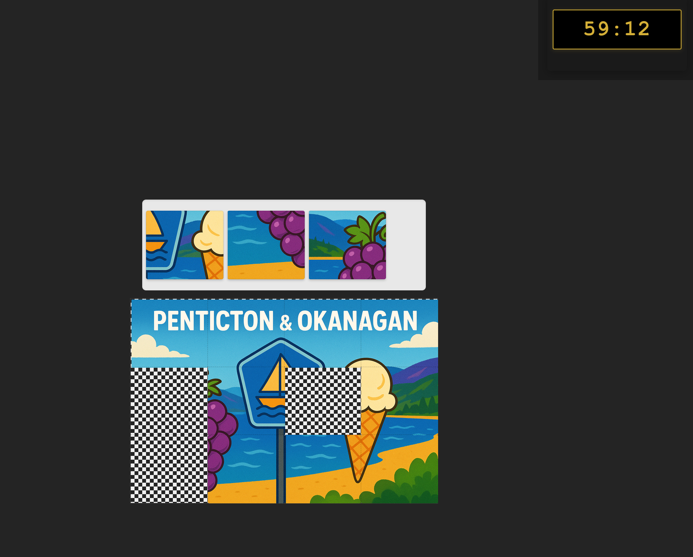
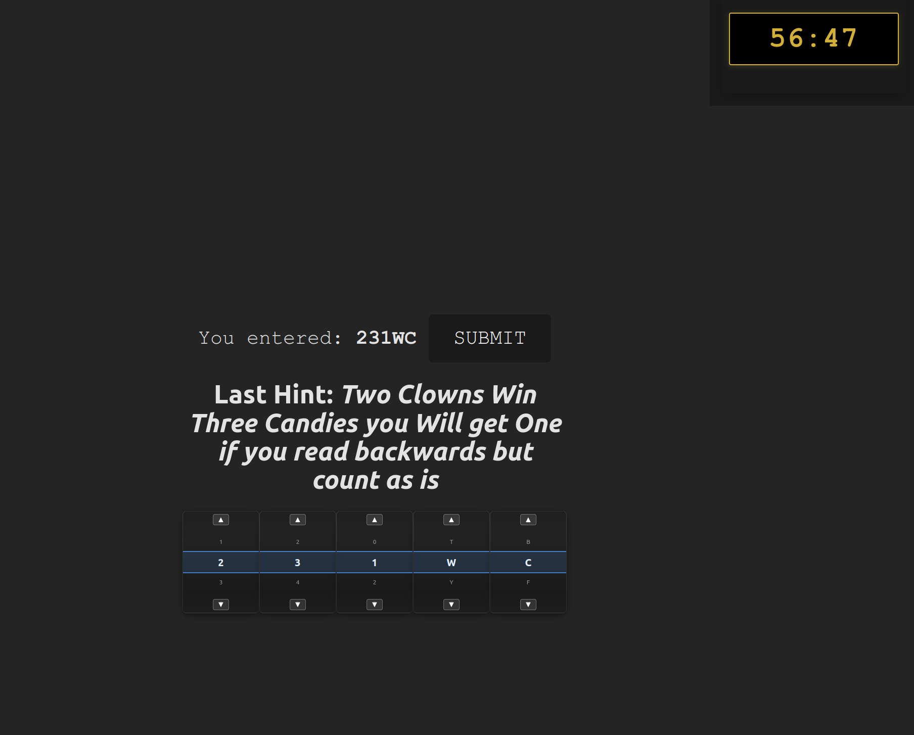

# 🐣 Easter Puzzle: Egg Hunt Game

Welcome to **Easter Puzzle**, a vibe-codded drag-and-drop egg hunt game where kids can solve puzzles, uncover hidden code, and win parents love! Built with **React 19**, **TypeScript**, and **Vite**, this interactive game is designed to be fun, educational, and lightweight for the web.

---

## ✨ Features

- 🧩 Puzzle-based gameplay
- 🎨 Drag-and-drop mechanics (powered by `react-dnd`)
- 📱 Touch support for mobile devices
- 🎉 "You Win" screen and hidden surprises

---

## 🚀 Getting Started

To get the game running locally:

```bash
# Clone the repo
git clone https://github.com/your-username/easter-puzzle.git
cd easter-puzzle

# Install dependencies
npm install

# Start the development server
npm run dev
```

Then open [http://localhost:5173](http://localhost:5173) in your browser.

---

## 📦 Build for Production

```bash
npm run build
```

Preview the build output locally:

```bash
npm run preview
```

---

## 🛠️ Tech Stack

- **React 19**
- **Vite**
- **TypeScript**
- **react-dnd** for drag-and-drop
- **ESLint** for linting and code quality

---

## 📸 Screenshots

| Puzzle View                                   | Code                                               | Victory Screen                               |
|-----------------------------------------------|----------------------------------------------------|----------------------------------------------|
|  |  |  |

> Place your screenshots in the `public/screenshots/` folder or `src/assets/screenshots/` depending on how you want to import them.

---

## 📁 Project Structure

```
easter-puzzle/
├── public/
│   
├── src/
│   ├── components/
│   ├── assets/
│   │    └── /screenshots
│   └── App.tsx
├── index.html
├── vite.config.ts
└── README.md
```

---

## 🎯 License

MIT License © 2025 

---

Happy egg hunting! 🐰🥚🌸
